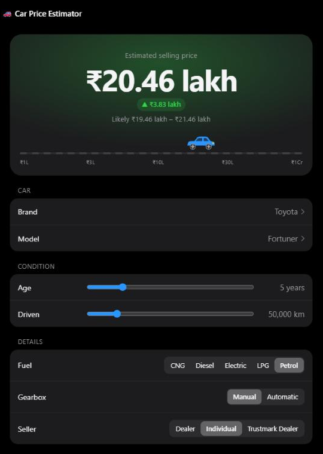

# 🚗 Used Car Price Predictor

Predicts the resale price of a used car in India from its brand, model, age, kilometres driven and specs.
A random forest trained on ~15,400 CarDekho listings, served through a small Flask app where the price updates live as you change the inputs.

<p align="center"></p>

| | Test R² | MAE | RMSE |
|---|---|---|---|
| Linear regression (baseline) | 0.79 | ₹1.64 L | ₹3.38 L |
| **Random forest** | **0.94** | **₹0.92 L** | **₹1.86 L** |
| Random forest, 5-fold CV | 0.93 (folds 0.90–0.95) | ₹1.00 L | — |

---

## How I got there

The interesting part of this project wasn't the model choice. It was finding out **why** the first model was wrong.

**1. Cleaning.** Removed 2 cars listed with 0 seats and 2 with absurd odometer readings (one at 3.8 million km). Lowercased brand names because `Isuzu` and `ISUZU` were counted as separate brands.

**2. Baseline.** Linear regression got R² 0.55. A random forest got 0.75, but with train R² 0.99, so it was overfitting. Limiting `max_depth` didn't help; test R² never got above ~0.74 at any depth. That told me the problem was in the data, not the model settings.

**3. Error analysis.** RMSE (₹5.6 L) was about 5× the MAE (₹1.1 L), which means a few predictions were wildly wrong. Sorting test cars by error showed the culprits:

| Car | Actual | Predicted |
|---|---|---|
| Ferrari (601 bhp) | ₹3.95 Cr | ₹1.08 Cr |
| Bentley (626 bhp) | ₹1.45 Cr | ₹0.50 Cr |

There was **one** Ferrari in the whole dataset, and it landed in the test set, so the model had never seen one. A random forest averages training prices, so it can't predict above the most expensive car it has seen. That single car accounted for most of the RMSE.

**4. Scoping decision.** Brands with fewer than 10 listings (Ferrari, Bentley, Rolls-Royce, Maserati, Mercedes-AMG, Force: **9 cars out of 15,407**) were removed. This is a business call as much as a technical one: people pricing cars on a site like CarDekho are mostly buying and selling everyday cars, and 1–3 examples aren't enough to learn supercar prices anyway.

Result: random forest R² went from **0.72 → 0.94**.

**5. Checking it wasn't luck.** Part of that jump came from the Ferrari leaving the test set, so I ran 5-fold cross-validation. Every fold scored between 0.90 and 0.95 (average 0.93), so the result holds across splits.

**6. What the model relies on.**

| Feature | Importance |
|---|---|
| `max_power` | 69% |
| `vehicle_age` | 16% |
| `km_driven` | 6% |
| `engine`, `mileage` | ~2% each |

`max_power` works as a proxy for how premium a car is, which overlaps heavily with brand. `engine` scores low not because engine size doesn't matter, but because it's strongly correlated with power, so the trees get the same information from `max_power` first.

### Things I tried that didn't help
- **Adding the car `model` as a feature:** MAE improved slightly, but R² dipped (0.75 → 0.72) because the supercar errors still dominated. It only paid off after step 4.
- **Predicting log(price):** about the same MAE, lower R².

---

## Limitations (being honest)

- **Not for luxury or exotic cars.** Rare brands were removed on purpose; predictions for very expensive cars will be poor.
- **Fuel type, gearbox and seller type barely change predictions.** Once the model knows the car model and its power, they add very little. That matches the feature importances, but it may not match reality perfectly.
- **The "likely range" in the app is ± the average error (₹1 lakh)**, not a proper prediction interval. It's tighter than it should be for expensive cars and looser for cheap ones.
- **I tuned `max_depth` by looking at test scores**, which slightly blurs the line between validation and test. The final model uses default depth, and the 5-fold CV result is the more trustworthy number.
- **No hyperparameter search or gradient boosting yet.** The gains came from understanding the data, and I wanted to get that right first.
- The data is a snapshot of listings, so prices reflect that market, not today's.

---

## Run it

```bash
pip install -r requirements.txt
streamlit run streamlit_app.py      # trains on first start (~20 s), then opens the app
```

Or without Streamlit: `python train.py` once, then `python server.py` and open http://localhost:8502.

## Project structure

```
notebook/car_price_analysis.py   the full analysis (exported from my Colab notebook)
data/cardekho_dataset.csv        CarDekho used-car listings (public Kaggle dataset)
carprice.py                      cleaning, training and prediction, shared by both apps
streamlit_app.py                 live demo: embeds the web UI as a two-way Streamlit component
server.py + train.py             same UI served by Flask instead
static/index.html                the web UI
```

## Credits

The data analysis and modelling are my own work, done with an AI tutor (Claude) coaching me through the steps. The web interface (`server.py`, `static/index.html`) was built with Claude's help; my focus in this project was the machine-learning side.
